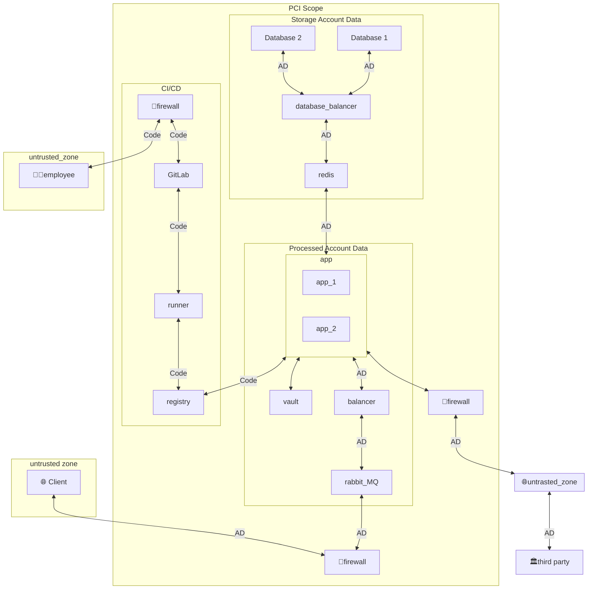

```mermaid
flowchart TB
	subgraph scope[PCI Scope]
		subgraph storage[Storage Account Data]
		    Database_1[Database 1] <--> |AD| database_balancer
		    Database_2[Database 2] <--> |AD| database_balancer
		    database_balancer <--> |AD| redis
		end
	    subgraph processed[Processed Account Data]
		    subgraph app
			    app_1 & app_2
			end
		    redis <-->|AD| app
		    app <--> vault
		    app <--> |AD| balancer
		    balancer <--> |AD| rabbit_MQ
	    end
	    app <--> firewall_3[🧱firewall]
	    rabbit_MQ <--> |AD| firewall_1[🧱firewall]
	    	    
	    subgraph CICD[CI/CD]
	        direction TBer
	        firewall_2[🧱firewall]
	        GitLab <--> |Code| runner
		    runner <--> |Code| registry
		end
		app <-->|Code| registry
	end
	
	subgraph untrasted_client[untrusted zone]
		direction LR
		client["🌐 Client"] <--> |AD| firewall_1
	end
	subgraph untrasted_proger[untrusted_zone]
		direction RL
		employee[🧑‍💻employee]
	end
	firewall_2 <--> |Code| employee
	firewall_2[🧱firewall] <--> |Code| GitLab
	subgraph untrasted_bank[🌐untrasted_zone]
	end
	firewall_3 <--> |AD| untrasted_bank
	untrasted_bank <--> |AD| bank[🏛️third party]
```