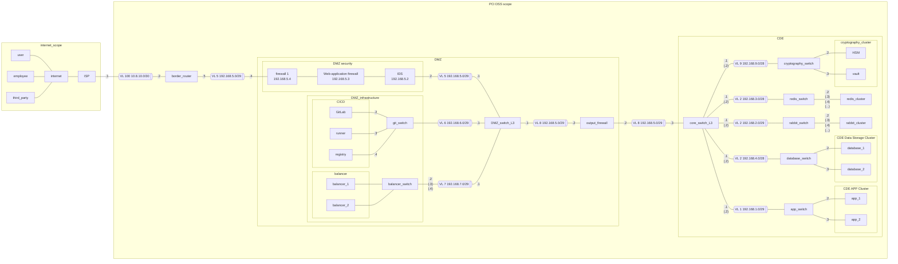

```mermaid
flowchart LR
    subgraph internet_scope
        internet
        user --- internet
        employee --- internet
        third_party --- internet
        ISP
        internet --- ISP
    end
    subgraph scope[PCI DSS scope]
         vlan100@{ shape: das, label: 'VL 100 10.8.10.0/30' }
         ISP-- .1 --- vlan100 -- .2 --- border_router


        border_router
        subgraph CDE
            subgraph "CDE APP Cluster"
                app_1
                app_2
            end
            app_switch
            app_switch-- .2 --- app_1
            app_switch-- .3 --- app_2
            subgraph "CDE Data Storage Cluster"
                database_1
                database_2
            end
            database_switch
            database_switch-- .2 --- database_1
            database_switch -- .3 --- database_2
            redis_cluster
            redis_switch
            subgraph cryptography_cluster
                HSM
                vault
            end
            cryptography_switch
            cryptography_switch -- .2 --- HSM
            cryptography_switch -- .3 --- vault
            redis_switch-- ".2<br>(.3)<br>(.4)<br>(...)" ---redis_cluster
            rabbit_cluster
            rabbit_switch  
            rabbit_switch-- ".2<br>(.3)<br>(.4)<br>(...)" ---rabbit_cluster       
            core_switch_L3
            vlan1@{ shape: das, label: 'VL 1 192.168.1.0/29' }
            vlan2@{ shape: das, label: 'VL 2 192.168.2.0/29' }
            vlan3@{ shape: das, label: 'VL 2 192.168.3.0/28' }
            vlan4@{ shape: das, label: 'VL 2 192.168.4.0/28' }
            vlan9@{ shape: das, label: 'VL 9 192.168.9.0/28' }
            core_switch_L3-- .1<br>(.2) ---vlan1 --- app_switch
            core_switch_L3-- .1<br>(.2) ---vlan4 --- database_switch
            core_switch_L3-- .1<br>(.2) ---vlan3 --- redis_switch
            core_switch_L3-- .1<br>(.2) ---vlan2 --- rabbit_switch
             core_switch_L3-- .1<br>(.2) ---vlan9 --- cryptography_switch
        end

        subgraph DMZ
            subgraph DMZ_security[DMZ security<br>]
                input_firewall[firewall 1<br> 192.168.5.4]
                WAF[Web-application firewall <br> 192.168.5.3]
                IDS[IDS <br> 192.168.5.2]
                input_firewall --- WAF ---IDS
            end

            subgraph DMZ_infrastructure
                subgraph CICD
                    GitLab
                    runner
                    registry
                end
                git_switch
                GitLab-- .2 --- git_switch
                runner-- .3 --- git_switch
                registry-- .4 --- git_switch
                subgraph balancer
                    balancer_1
                    balancer_2
                end
                balancer_switch
                balancer_1 & balancer_2 --- balancer_switch
            end
            DMZ_switch_L3
            vlan5@{ shape: das, label: 'VL 5 192.168.5.0/29' }
            vlan6@{ shape: das, label: 'VL 6 192.168.6.0/29' }
            vlan7@{ shape: das, label: 'VL 7 192.168.7.0/29' }
            IDS-- .2 ---vlan5 -- .1 --- DMZ_switch_L3
            git_switch ---vlan6 -- .1 --- DMZ_switch_L3
            balancer_switch-- .2<br>(.3)<br>(.4) ---vlan7 -- .1 --- DMZ_switch_L3
            vlan8_1@{ shape: das, label: 'VL 8 192.168.5.0/29' }
            
            output_firewall
            DMZ_switch_L3-- .1 --- vlan8_1 -- .2 --- output_firewall
            
        end
        vlan8_2@{ shape: das, label: 'VL 8 192.168.5.0/29' }
        output_firewall-- .2 --- vlan8_2 -- .3 --- core_switch_L3
        vlan5_1@{ shape: das, label: 'VL 5 192.168.5.0/29' }
        border_router-- .5 --- vlan5_1 -- .4 --- input_firewall
    end

    
   
```
