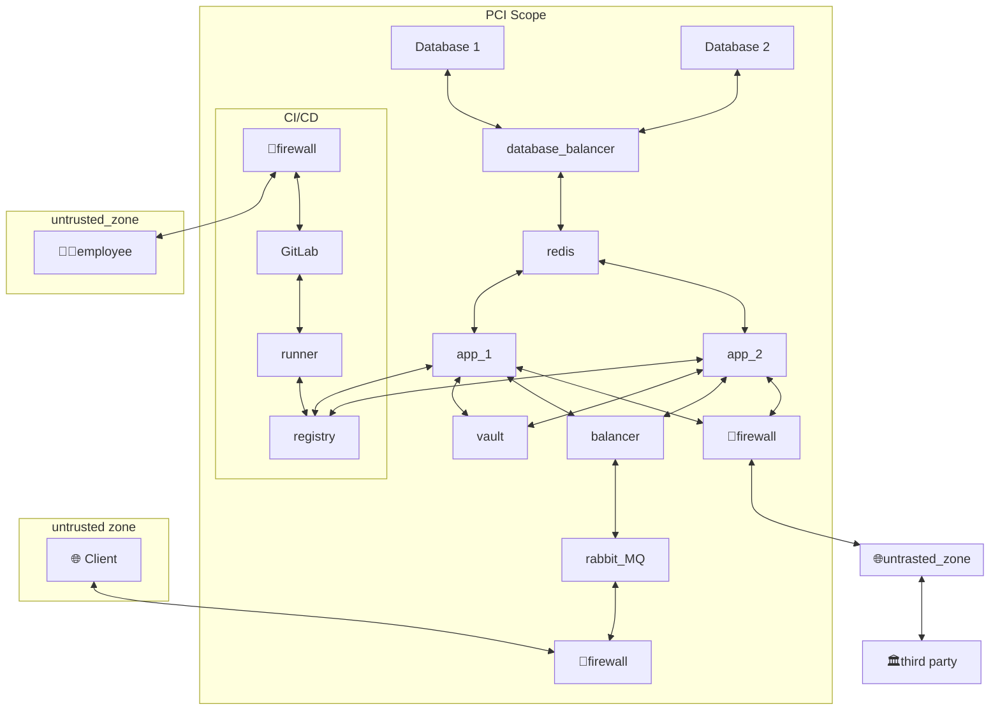

```mermaid
flowchart TB
	subgraph scope[PCI Scope]
	    Database_1[Database 1] <--> database_balancer
	    Database_2[Database 2] <--> database_balancer
	    database_balancer <--> redis
	    app_1 & app_2
	    redis <--> app_1 & app_2
	    app_1 <--> vault
	    app_2 <--> vault
	    app_1 <--> balancer
	    app_2 <--> balancer
	    balancer <--> rabbit_MQ
	    app_1 & app_2 <--> firewall_3[🧱firewall]
	    rabbit_MQ <--> firewall_1[🧱firewall]
	    	    
	    subgraph CICD[CI/CD]
	        direction TBer
	        firewall_2[🧱firewall]
	        GitLab <--> runner
		    runner <--> registry
		end
		app_1 <--> registry
		app_2 <--> registry
	end
	
	subgraph untrasted_client[untrusted zone]
		direction LR
		client["🌐 Client"] <--> firewall_1
	end
	subgraph untrasted_proger[untrusted_zone]
		direction RL
		employee[🧑‍💻employee]
	
	end
	firewall_2 <--> employee
	firewall_2[🧱firewall] <--> GitLab
	subgraph untrasted_bank[🌐untrasted_zone]
	end
	firewall_3 <--> untrasted_bank
	untrasted_bank <--> bank[🏛️third party]
```