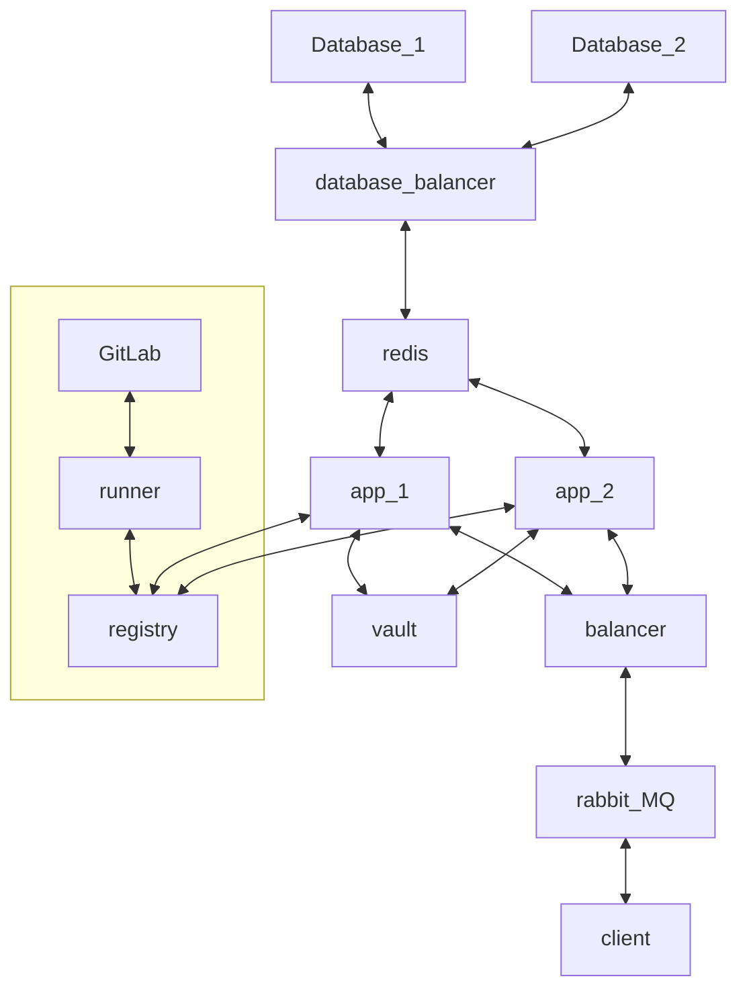

```mermaid
flowchart TB
    Database_1 <--> database_balancer
    Database_2 <--> database_balancer
    database_balancer <--> redis
    app_1 & app_2
    redis <--> app_1 & app_2
    app_1 <--> vault
    app_2 <--> vault
    app_1 <--> balancer
    app_2 <--> balancer
    balancer <--> rabbit_MQ
    rabbit_MQ <--> client
    
    subgraph CICD[ ]
        direction TBer
        GitLab <--> runner
	    runner <--> registry
	end
	app_1 <--> registry
	app_2 <--> registry
	
    

```